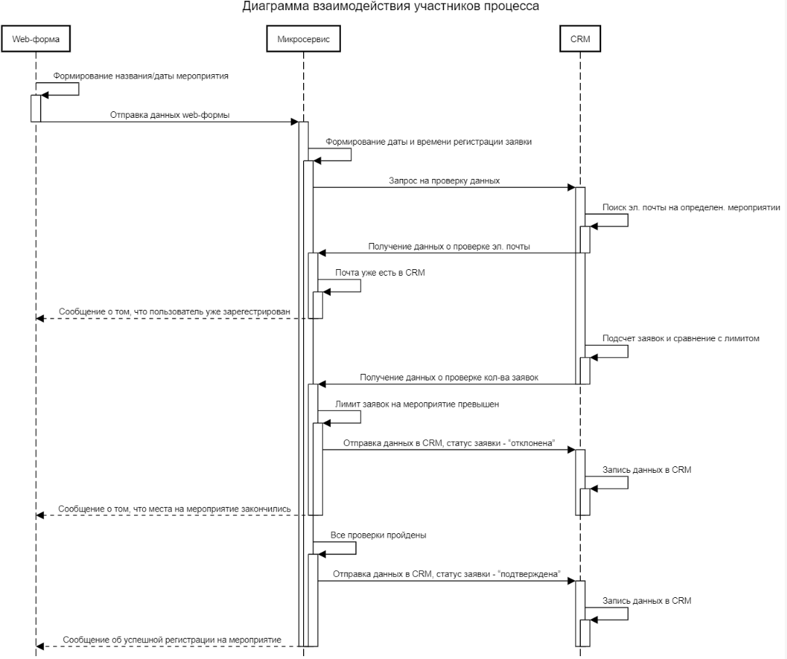

## Тестовое Задание для соискателя на роль аналитика-разработчика в проект внедрения и поддержки low-code системы. Майоров И.А.

## **1. Описать перечень входных данных в предложенном формате**

Перечень входных данных описан в Таб. 1

Таблица 1 - Описание входных данных

| Атрибут | Тип данных | Обязательный? | Описание |
| --- | --- | --- | --- |
| Адрес электронной почты | Строка | Да | Адрес электронной почтыдля подтверждениярегистрации и отправкипригласительных билетов |
| Контактный номер телефона | Строка | Нет | Телефон для связи сзарегистрированнымпосетителем |
| Имя | Строка | Да | Имя зарегистрированногоПосетителя для обращения к нему |
| Фамилия | Строка | Да | Фамилия зарегистрированногопосетителя для обращения к нему |
| Компания | Строка | Нет | Информация о компании, в которой работает зарегистрированныйпосетитель для выборки в CRM |
| Роль в проектах | Строка | Нет | Доп. информация о роли в проектах, над которыми работал зарегистрированныйпосетитель |
| Название мероприятия | Датавремя | Да | Название мероприятия для фильтрации в CRM |
| Дата проведения мероприятия | Датавремя | Да | Дата проведения мероприятия для фильтрации в CRM |

**2. Описать перечень выходных данных в предложенном формате**

Перечень выходных данных описан в Таб. 2

Таблица 2 - Описание выходных данных

| Атрибут | Тип данных | Обязательный? | Описание |
| --- | --- | --- | --- |
| Адрес электронной почты | Строка | Да | Адрес электронной почтыдля подтверждениярегистрации и отправкипригласительных билетов |
| Имя | Строка | Да | Имя зарегистрированногопосетителя для обращения к нему |
| Фамилия | Строка | Да | Фамилия зарегистрированногопосетителя для обращения к нему |
| Контактный номер телефона | Строка | Нет | Телефон для связи сзарегистрированнымпосетителем |
| Название мероприятия | Датавремя | Да | Название мероприятия для фильтрации в CRM |
| Дата проведения мероприятия | Датавремя | Да | Дата проведения мероприятия для фильтрации в CRM |
| Дата и время регистрации заявки | Датавремя | Да | Дата и время регистрации заявки для выборки в CRM |
| Компания | Строка | Нет | Информация о компании, в которой работает зарегистрированныйпосетитель для выборки в CRM |
| Статус заявки | Логический | Да | Подтверждена/отклонена для выборки по статусу в CRM |

**3. Разработать диаграмму взаимодействия участников процесса**

**4. Описать алгоритм работы микросервиса**

Пользователь заполняет поля ввода вебформы и по нажатию кнопки "Отправить" микросервис получает данные и делает запрос в CRM, например, с помощью HTTP, в котором проверяет:

1. Наличие электронной почты на определенном мероприятии в CRM. Если данные уже присутствуют в системе CRM, то микросервис возвращает в Web-форму следующее сообщение: "_Вы уже были зарегистрированы на мероприятие. Вся информация направлена вам на адрес электронной почты. Если письмо не дошло, проверьте папку "спам" на сервере или свяжитесь с организаторами_".
2. Если данные электронный почты отсутствуют в системе CRM, то микросервис делает запрос со второй проверкой, где получает количество зарегистрированных заявок и в случае превышения установленного лимита микросервис отправляет данные, описанные в таб. 2, и статус заявки – "отклонена" в систему CRM, а также возвращает в Web-форму следующее сообщение: "_К сожалению, кол-во свободных мест закончилось, мы не можем вас зарегистрировать на мероприятие_".
3. Если проверка 1 и 2 не прошли, то микросервис отправляет данные, описанные в таб. 2, и статус заявки – "подтверждена" в систему CRM, а также возвращает в Web-форму следующее сообщение: "_Вы успешно зарегистрированы на мероприятие, подробная информация направлена вам на электронную почту_".
